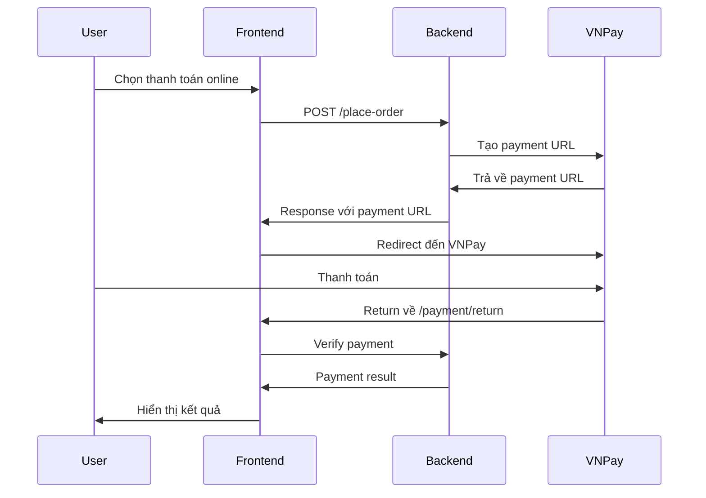
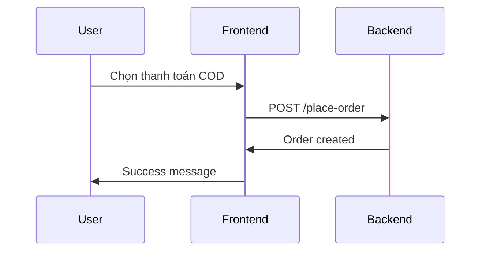

# Payment Integration Documentation

## Tổng quan

Hệ thống thanh toán VNPay đã được tích hợp vào frontend với đầy đủ các tính năng:
- Thanh toán online qua VNPay
- Thanh toán khi nhận hàng (COD)
- Chuyển khoản ngân hàng
- Xử lý return từ VNPay
- Error handling và validation

## Cấu trúc Files

### 1. API Integration
- `src/app/lib/orderApi.ts` - Cập nhật hàm `placeOrder` để xử lý thanh toán online
- `src/app/lib/config.ts` - Thêm payment configuration

### 2. Components
- `src/app/Component/PaymentMethodSelector.tsx` - Component chọn phương thức thanh toán
- `src/app/Component/OrderSummary.tsx` - Component hiển thị tóm tắt đơn hàng

### 3. Pages
- `src/app/payment/return/page.tsx` - Trang xử lý return từ VNPay
- `src/app/checkout/page.tsx` - Cập nhật trang checkout

### 4. Utilities
- `src/app/lib/paymentUtils.ts` - Utility functions cho payment

## Flow Thanh Toán

### 1. Thanh toán Online (VNPay)



### 2. Thanh toán COD



## API Endpoints

### 1. Place Order
```typescript
POST /api/v1/user/orders/place-order
```

**Request Body:**
```json
{
  "items": [
    {
      "product_id": 1,
      "quantity": 2
    }
  ],
  "name": "Nguyễn Văn A",
  "phone": "0123456789",
  "address": "123 Đường ABC, Quận 1, TP.HCM",
  "email": "user@example.com",
  "payment_method": "online_payment",
  "coupon_code": "SAVE10",
  "subtotal": 200000,
  "shipping_fee": 30000,
  "tax": 0,
  "discount": 0,
  "total": 230000,
  "notes": "Giao hàng giờ hành chính"
}
```

**Response cho online_payment:**
```json
{
  "message": "Đặt hàng thành công",
  "order_id": 123,
  "order_number": "ORD20250101001",
  "payment": {
    "success": true,
    "data": {
      "payment_url": "https://sandbox.vnpayment.vn/paymentv2/vpcpay.html?...",
      "transaction_ref": "123_1234567890"
    }
  }
}
```

### 2. VNPay Return
```typescript
GET /api/v1/vnpay-return
```

**Response thành công:**
```json
{
  "success": true,
  "message": "Payment successful",
  "data": {
    "order_id": 123,
    "transaction_id": "12345678",
    "amount": 230000,
    "bank_code": "NCB",
    "payment_time": "20250101100000"
  }
}
```

## Components Usage

### 1. PaymentMethodSelector

```tsx
import PaymentMethodSelector from '@/app/Component/PaymentMethodSelector';

const [selectedMethod, setSelectedMethod] = useState('cod');

<PaymentMethodSelector
  selectedMethod={selectedMethod}
  onMethodChange={setSelectedMethod}
/>
```

### 2. OrderSummary

```tsx
import OrderSummary from '@/app/Component/OrderSummary';

<OrderSummary
  items={cart}
  subtotal={subtotal}
  shipping={shippingFee}
  tax={tax}
  discount={discount}
  total={total}
  paymentMethod={paymentMethod}
/>
```

## Error Handling

### 1. Payment Errors

```typescript
import { handlePaymentError } from '@/app/lib/paymentUtils';

try {
  const result = await placeOrder(orderData);
} catch (error) {
  const errorMessage = handlePaymentError(error);
  toast.error(errorMessage);
}
```

### 2. Common Error Codes

| Code | Description | Action |
|------|-------------|--------|
| `INSUFFICIENT_STOCK` | Hết hàng | Hiển thị thông báo, cập nhật cart |
| `INVALID_COUPON` | Mã giảm giá không hợp lệ | Xóa coupon, hiển thị lỗi |
| `PAYMENT_FAILED` | Thanh toán thất bại | Cho phép thử lại |
| `NETWORK_ERROR` | Lỗi mạng | Retry mechanism |
| `TIMEOUT_ERROR` | Hết thời gian | Cho phép thử lại |

## Environment Variables

```bash
# API Configuration
NEXT_PUBLIC_API_BASE_URL=http://localhost:8000/api/v1

# Payment Configuration
NEXT_PUBLIC_PAYMENT_RETURN_URL=http://localhost:3000/payment/return
NEXT_PUBLIC_VNPAY_URL=https://sandbox.vnpayment.vn/paymentv2/vpcpay.html
```

## Testing

### 1. Test Cases

#### Place Order với COD
```typescript
// Test data
const orderData = {
  payment_method: 'cod',
  // ... other fields
};

// Expected: No payment URL, order status = pending
```

#### Place Order với Online Payment
```typescript
// Test data
const orderData = {
  payment_method: 'online_payment',
  // ... other fields
};

// Expected: Payment URL returned, redirect to VNPay
```

#### Payment Success
```typescript
// Mock VNPay return
const mockReturn = {
  vnp_ResponseCode: '00',
  vnp_TxnRef: '123_1234567890',
  vnp_Amount: '23000000'
};

// Expected: Order status = paid, success message
```

#### Payment Failed
```typescript
// Mock VNPay return
const mockReturn = {
  vnp_ResponseCode: '09',
  vnp_TxnRef: '123_1234567890'
};

// Expected: Order status = payment_failed, error message
```

### 2. Test Commands

```bash
# Run tests
npm test

# Test specific payment flow
npm test -- --testNamePattern="Payment"
```

## Security Considerations

### 1. Data Validation
- Validate tất cả input từ user
- Sanitize data trước khi gửi API
- Validate payment response từ VNPay

### 2. HTTPS
- Sử dụng HTTPS cho production
- Validate SSL certificates
- Secure cookie settings

### 3. Error Handling
- Không expose sensitive data trong error messages
- Log errors cho debugging
- Implement rate limiting

## Deployment

### 1. Production Setup

```bash
# Set environment variables
NEXT_PUBLIC_API_BASE_URL=https://api.yourdomain.com/api/v1
NEXT_PUBLIC_PAYMENT_RETURN_URL=https://yourdomain.com/payment/return
NEXT_PUBLIC_VNPAY_URL=https://pay.vnpay.vn/vpcpay.html
```

### 2. SSL Configuration

```nginx
# Nginx configuration
server {
    listen 443 ssl;
    server_name yourdomain.com;
    
    ssl_certificate /path/to/cert.pem;
    ssl_certificate_key /path/to/key.pem;
    
    location /payment/return {
        proxy_pass http://localhost:3000;
        proxy_set_header Host $host;
        proxy_set_header X-Real-IP $remote_addr;
    }
}
```

## Monitoring

### 1. Payment Metrics
- Success rate
- Average transaction time
- Error rates by type
- Revenue by payment method

### 2. Logging
```typescript
// Log payment events
console.log('Payment initiated:', {
  orderId: order.id,
  amount: order.total,
  method: order.payment_method,
  timestamp: new Date().toISOString()
});
```

## Troubleshooting

### 1. Common Issues

#### Payment URL không tạo được
- Kiểm tra VNPay configuration
- Verify order data format
- Check API response

#### Return page không load
- Kiểm tra route configuration
- Verify environment variables
- Check network connectivity

#### Payment verification failed
- Kiểm tra signature validation
- Verify transaction data
- Check backend logs

### 2. Debug Commands

```bash
# Check environment variables
echo $NEXT_PUBLIC_API_BASE_URL
echo $NEXT_PUBLIC_PAYMENT_RETURN_URL

# Test API connectivity
curl -X GET $NEXT_PUBLIC_API_BASE_URL/health

# Check payment return
curl -X GET "http://localhost:3000/payment/return?vnp_ResponseCode=00&vnp_TxnRef=test"
```

## Future Enhancements

### 1. Additional Payment Methods
- MoMo
- ZaloPay
- PayPal
- Stripe

### 2. Advanced Features
- Recurring payments
- Installment payments
- Payment analytics
- Fraud detection

### 3. Mobile Optimization
- PWA support
- Mobile payment apps
- QR code payments
